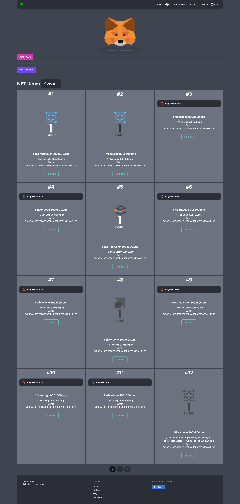
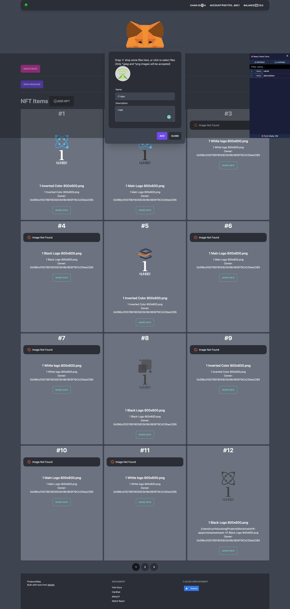

## ✨ [Demo](https://nft-app.productsway.com/)

## Screenshot

# 🌐 分散型NFTプラットフォーム  

## 📌 概要  
この分散型NFTプラットフォームは、**ICPのスケーラブルなインフラ**を活用し、ユーザーが**NFTをミント、購入、販売、そして安全に保管**できる環境を提供します。**Internet Identity**を統合することで**安全なパスワード不要の認証**を実現し、**Canisters**を活用することで**コスト効率の高いストレージ**を確保。さらに、**マルチチェーン互換性**を備え、異なるブロックチェーン間でNFTをシームレスに移動できます。  

## 🚀 機能  
- **NFTのミント＆取引** – ユーザーは分散型マーケットプレイスでNFTを作成、リスト化、取引可能。  
- **安全な認証** – **Internet Identity**を統合し、シームレスでセキュアなログインを実現。  
- **オンチェーン・メタデータストレージ** – **NFT.storage & Web3.storage**を活用し、改ざん不可能なNFTメタデータを保存。  
- **マルチチェーン互換性** – **クロスチェーンNFTの相互運用性**をサポートする設計。  
- **最適化されたUI/UX** – **React、Vite、Tailwind CSS**を使用し、高速かつ直感的なユーザー体験を提供。  

## 🛠 解決する課題  
従来のNFTプラットフォームは以下のような問題を抱えています：  
✅ **高額なガス代** – ICPの低コストなトランザクションで解決。  
✅ **セキュリティの脆弱性** – **ICPの分散型Canisters**を活用し、リスクを軽減。  
✅ **中央集権リスク** – 取引のための中央管理機関を排除。  
✅ **限定的な相互運用性** – 異なるブロックチェーン間でNFTを転送可能に。  
✅ **使いにくいUI/UX** – 初心者でも扱いやすい直感的なインターフェースを提供。  

## 🔥 直面した課題  
- **ガス効率の最適化** – 複数のブロックチェーンと連携する際のコスト削減。  
- **Internet Identityの統合** – セキュアかつスムーズな認証の実現。  
- **ユーザーフレンドリーなUIの設計** – Web3初心者でも簡単に利用できるUXを構築。  
- **ICP上でのスマートコントラクトのデプロイ** – エコシステム内でのスムーズな動作を確保。  

## 🛠 使用した技術  
- **ICP Canisters** – 分散型スマートコントラクトの実行。  
- **Internet Identity (II)** – 安全なパスワード不要の認証。  
- **Hardhat & Solidity** – スマートコントラクトの開発とテスト。  
- **Vite, React, Tailwind CSS** – フロントエンド開発。  
- **NFT.storage & Web3.storage** – 分散型NFTメタデータストレージ。  
- **Web3.js & ethers.js** – ブロックチェーンとの連携。  

## ⚙️ 開発プロセス  
まず、**スケーラビリティとセキュリティ**を重視した**モジュール設計**を行いました。**SolidityとHardhat**を活用して**NFTのミント＆取引機能**を開発・テストし、フロントエンドは**ReactとVite**を用いて**高速で直感的なUX**を提供。最終的に、**ICP CanistersとInternet Identity**を統合し、セキュリティと分散化を強化。**NFT.storage**を利用してメタデータの保存を実現しました。  

## 📚 学んだこと  
✅ **ICP Canisters**のスケーラブルかつ分散型のスマートコントラクトの強み。  
✅ **Internet Identity**による簡単かつ安全な認証の実現方法。  
✅ **クロスチェーンNFTの相互運用性**が真の分散型エコシステムには不可欠であること。  
✅ **ガス代とストレージコストの最適化**がWeb3アプリの持続可能性に重要であること。  

## 🔮 今後の展望  
🎨 **フラクショナライズドNFT** – 高価値NFTの共同所有を可能に。  
💰 **オンチェーン・ロイヤリティ機能** – 二次販売時の公正なアーティスト報酬を実現。  
🔗 **マルチチェーンサポートの拡張** – EthereumやSolanaとのクロスチェーン転送を実装。  
🏛 **コミュニティガバナンス＆DAO** – ユーザーがプラットフォームの改善に投票可能に。  
📱 **モバイル対応** – モバイル環境での利便性向上と普及促進。  

## 🌍 デプロイ＆デモ  
🚀 **ライブデモ**：[こちら](https://nft-icp.netlify.app)  
📂 **GitHubリポジトリ**：[リポジトリリンク](https://github.com/Wadill/Icp-nft-dapp.git)  

---  

📢 **ICPの最先端技術でNFTの未来を切り開こう！** 🚀